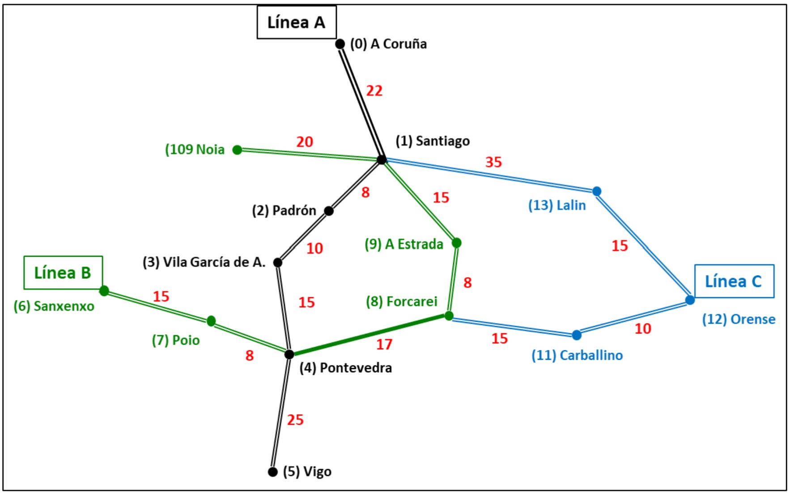
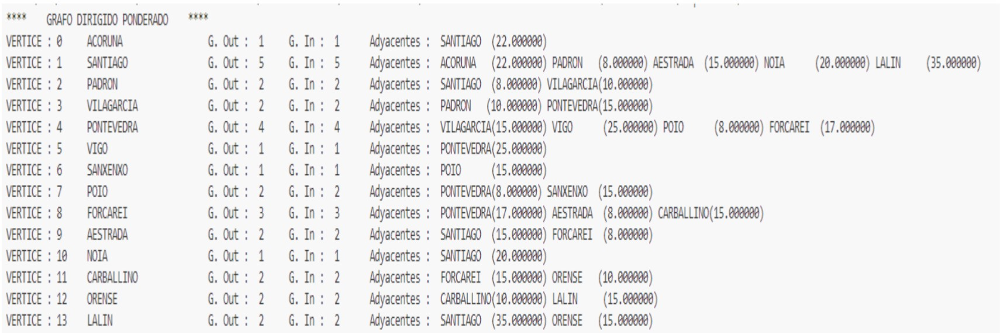
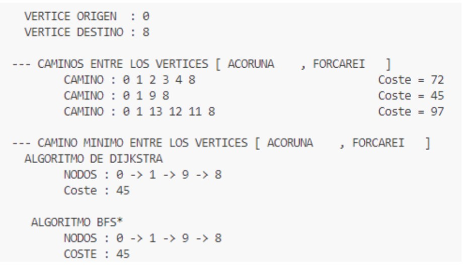

# Graph-based Train Route Optimizer

## Project Overview

This project implements a graph-based train route optimizer for the Xunta de Galicia's mobility project in the western region of Spain. The system models the train network as a weighted, undirected graph where nodes represent cities/towns and edges represent train connections with their associated travel times.

## Problem Statement

The main objectives of this project are:
1. Computationally represent the train network using appropriate data structures.
2. Find all possible routes between any two given cities/towns.
3. Determine the optimal route with the shortest travel time between two points.

## Technologies Used

- C++11
- Standard Template Library (STL)
- Object-Oriented Programming (OOP)
- Graph Theory

## Project Structure

The project is structured around a `GrafoDP` class that represents the train network. Key components include:

- `Edge` struct: Represents connections between cities with associated weights (travel times).
- `GrafoDP` class: The main class that encapsulates the graph structure and algorithms.
- Vector of adjacency lists: Used to represent the graph efficiently.
- Various methods for graph manipulation and path finding.

## Key Features

1. **Graph Representation**: Utilizes an adjacency list representation for efficient storage and traversal of the graph.
2. **Bidirectional Connections**: All train connections are modeled as bidirectional edges.
3. **Weighted Edges**: Each connection has an associated weight representing the travel time in minutes.
4. **Multiple Path Finding**: Implements algorithms to find all possible paths between two points.
5. **Optimal Route Calculation**: Determines the shortest path in terms of total travel time.
6. **User Interaction**: Allows users to input origin and destination cities to find routes.

## Algorithms Implemented

1. **Depth-First Search (DFS)**: Used in the `Caminos` method to find all possible paths between two vertices.
2. **Dijkstra's Algorithm**: Implemented in `Camino_Minimo_Dijkstra` to find the shortest path between two vertices.
3. **Modified Breadth-First Search (BFS)**: Used in `Camino_Minimo_BFS` as an alternative method to find the shortest path.

## How to Use

1. Compile the C++ program using a C++11 compatible compiler.
2. Run the executable.
3. The program will display the graph structure.
4. Enter the index of the origin city when prompted.
5. Enter the index of the destination city when prompted.
6. The program will output:
   - All possible paths between the origin and destination
   - The shortest path using Dijkstra's algorithm
   - The shortest path using the modified BFS algorithm

## Sample Output

The program provides detailed output showing the graph structure and the results of path-finding algorithms. Here are two example outputs:

### Graph Structure

This image shows the structure of the graph, detailing each vertex (city) with its connections (adjacent cities) and the associated travel times.

### Path Finding Results

This image demonstrates the output for a specific route query:
- Origin: A Coruña (Vertex 0)
- Destination: Forcarei (Vertex 8)

The output includes:
1. All possible paths between A Coruña and Forcarei, with their respective costs.
2. The shortest path found using Dijkstra's algorithm.
3. The shortest path found using the modified BFS algorithm.

Both Dijkstra's algorithm and the modified BFS algorithm found the same optimal path: 0 -> 1 -> 9 -> 8, with a total cost of 45 minutes.

## Visualization

The train network visualization (FRED-Trains.jpg) helps in understanding the structure of the network, including the three lines (A, B, and C) and the travel times between stations.

## Future Enhancements

1. Implement a graphical user interface (GUI) for easier interaction.
2. Add real-time updates for train schedules and delays.
3. Incorporate multi-criteria optimization (e.g., considering both time and cost).
4. Extend the system to handle larger networks and additional constraints.

## Contributing

Contributions to this project are welcome. Please fork the repository and submit a pull request with your proposed changes.

## License

This project is open-source and available under the MIT License.
